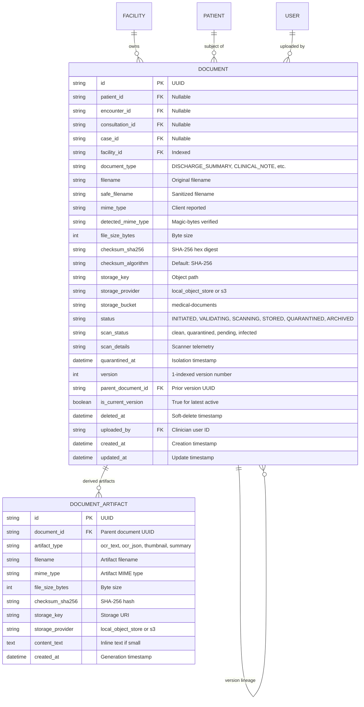
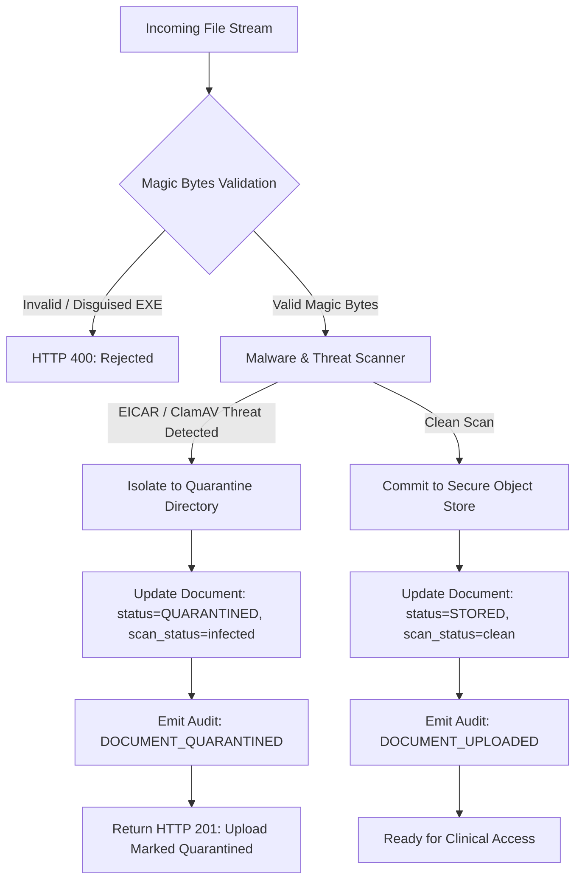
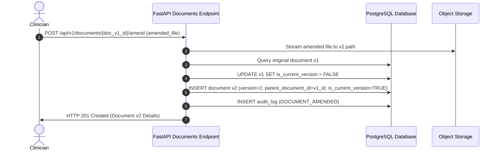

# CLINOVA AI — MEDICAL DOCUMENT ARCHITECTURE

> **Document Version:** 1.0.0  
> **Phase:** 3 — Medical Documents & Object Storage  
> **Standard:** HIPAA Security Rule § 164.312, ISO 27001, DICOM PS3.10  
> **Status:** Production-Grade / Active  

---

## 1. Executive Summary

Clinova AI's Medical Document Architecture delivers an enterprise, compliance-ready storage, validation, and lifecycle framework for clinical artifacts. Designed to eliminate common healthcare IT vulnerabilities—such as database bloat, MIME-spoofing attacks, in-memory buffer overflows, and cross-tenant data leaks—the architecture establishes strict separation between document metadata in PostgreSQL and encrypted file objects in decoupled object storage.

### Core Architecture Highlights
- **Zero Raw Binary Storage in Database:** PostgreSQL stores only validated metadata, cryptographic checksums, storage URIs, and audit lineages. Raw files are never stored in the database.
- **Defense-in-Depth Validation:** Client-reported MIME types and file extensions are treated as untrusted. Files undergo magic byte signature inspection to detect disguised executables (`MZ`, `ELF`, PE binaries) before storage persistence.
- **Antivirus Pipeline & Quarantine Isolation:** Integrated anti-malware pipeline with ClamAV integration hooks and EICAR signature detection isolates threats immediately into an unmapped quarantine vault, blocking download attempts with `HTTP 403 Forbidden`.
- **Immutable Versioning & Amendments:** Medical documents are legally and clinically immutable. Changes create a new version (`v2`, `v3`) while preserving historical records and marking superseded documents.
- **Derived Artifacts Linage:** OCR text, structural JSON extractions, and thumbnails link directly to their parent document with independent storage tracking.
- **Soft Deletion & Retention Compliance:** Clinical records are never hard-deleted; soft deletion archives records while retaining auditability for statutory retention periods (7–10 years).

---

## 2. Document Data Model & Schema

The document ecosystem is managed across two primary relational entities in PostgreSQL: `documents` and `document_artifacts`.

### 2.1 Entity Relationship Diagram

### 2.2 Enumerations and Allowed Clinical Types

#### `DocumentType`
- `DISCHARGE_SUMMARY`: Hospital and outpatient discharge summaries.
- `CLINICAL_NOTE`: Progress notes, consultation notes, clinical impressions.
- `LAB_REPORT`: Clinical pathology, biochemistry, and microbiology reports.
- `RADIOLOGY_IMAGE`: X-rays, CTs, MRIs, and ultrasound scans (including DICOM).
- `PRESCRIPTION`: Pharmacological orders and prescription slips.
- `REFERRAL_LETTER`: Inter-facility and specialist clinical referral documentation.
- `CONSENT_FORM`: Patient authorizations, procedure consents, and HIPAA disclosures.

#### `DocumentStatus`
- `INITIATED`: Upload started, streaming initialized.
- `VALIDATING`: Magic byte inspection, extension check, and size validation in progress.
- `SCANNING`: Antivirus engine and threat pattern inspection in progress.
- `STORED`: File passed validation and malware scanning; actively stored and accessible.
- `QUARANTINED`: Malicious payload or suspicious signature detected; isolated in quarantine vault.
- `ARCHIVED`: Document soft-deleted for retention compliance; suppressed from active clinical views.

---

## 3. Defense-in-Depth File Validation

### 3.1 Magic Bytes Verification Matrix

Every uploaded binary has its initial bytes inspected regardless of what the browser or HTTP header indicates:

| Format / Category | Allowed Extensions | Expected Magic Bytes (Hex) | ASCII Signature |
| :--- | :--- | :--- | :--- |
| **PDF Document** | `.pdf` | `25 50 44 46` | `%PDF` |
| **PNG Image** | `.png` | `89 50 4E 47 0D 0A 1A 0A` | `\x89PNG\r\n\x1a\n` |
| **JPEG Image** | `.jpg`, `.jpeg` | `FF D8 FF` | `\xFF\xD8\xFF` |
| **TIFF Medical Image** | `.tif`, `.tiff` | `49 49 2A 00` or `4D 4D 00 2A` | `II*` (Little-endian) / `MM*` (Big-endian) |
| **WebP Image** | `.webp` | `52 49 46 46 ... 57 45 42 50` | `RIFF....WEBP` |
| **DICOM Image** | `.dcm`, `.dicom` | `44 49 43 4D` (at offset 128) | `DICM` |

### 3.2 Blocked Executable and Threat Signatures

Any file containing the following signatures is rejected immediately with `HTTP 400 Bad Request` or `HTTP 422 Unprocessable Entity`:

| Threat Category | Forbidden Magic Bytes / Signatures | Description |
| :--- | :--- | :--- |
| **DOS / Windows Executable** | `4D 5A` (`MZ`) | Portable Executables (.exe, .dll, .scr) |
| **Linux Executable** | `7F 45 4C 46` (`\x7fELF`) | ELF Binaries (.so, .bin) |
| **Shell / Script Disguise** | `23 21 2F` (`#!/`) | Shell / bash scripts disguised as documents |
| **Java Class** | `CA FE BA BE` | Compiled Java bytecode |
| **ZIP / JAR Archive disguised** | `50 4B 03 04` | Uninspected ZIP packages claiming to be single images |

### 3.3 Filename Sanitization & Path Traversal Prevention

User-provided filenames are strictly sanitized before storage or OS interaction:
1. Strips directory navigation characters: `../`, `..\\`, `/`, `\`.
2. Strips control characters and null bytes (`\0`).
3. Retains only alphanumeric characters, periods, underscores, and hyphens (`[a-zA-Z0-9._-]`).
4. Generates a canonical `safe_filename` alongside the original display filename.

---

## 4. Antivirus Pipeline & Quarantine Architecture

### 4.1 Threat Quarantine Workflow
1. When a threat signature is discovered (such as the standard EICAR test string `X5O!P%@AP[4\PZX54(P^)7CC)7}$EICAR-STANDARD-ANTIVIRUS-TEST-FILE!$H+H*` or a ClamAV signature match):
   - The file stream is terminated.
   - The payload is moved to `/app/storage_data/quarantine/{document_id}_{safe_filename}`.
   - The quarantine vault is outside of the active object store path and is inaccessible via standard web endpoints.
2. The database record is tagged with:
   - `status = DocumentStatus.QUARANTINED`
   - `scan_status = "quarantined"`
   - `quarantined_at = datetime.now(timezone.utc)`
   - `scan_details = "Signature match: EICAR-Standard-Antivirus-Test-File detected."`
3. Any subsequent attempt to download or stream the file triggers `HTTP 403 Forbidden` with the error detail:
   `"Access denied: Document '...' has been quarantined due to security threats."`

---

## 5. Document Versioning & Clinical Amendments

Clinical records cannot be destructively overwritten due to legal and medical record integrity mandates.

- When `POST /{id}/amend` is called:
  - The previous version's `is_current_version` is flipped to `False`.
  - A new `Document` row is created with `version = prior.version + 1`.
  - `parent_document_id` establishes the bidirectional lineage.
  - The amended file is stored in `/v2/` of the storage hierarchy, leaving the `/v1/` object completely untouched.

---

## 6. Derived Artifacts Architecture

Medical documents frequently generate downstream analytical products:
- **OCR Transcripts:** Raw text extracted from scanned PDFs or images.
- **Structured Findings:** JSON key-value pairs parsed from lab reports.
- **Thumbnails:** Scaled-down previews for EHR display.

The `document_artifacts` table stores these artifacts:
- Linked via foreign key `document_id` with `CASCADE` semantics.
- Carries independent `artifact_type`, `file_size_bytes`, `storage_key`, and `content_text`.
- For small artifacts (<64KB, such as OCR extracted text), `content_text` provides instant relational access without requiring an object storage read.

---

## 7. Soft Deletion & Audit Trail

### Soft Deletion Protocol
- `DELETE /api/v1/documents/{id}` does not purge binary files from disk.
- Sets `deleted_at = datetime.now(timezone.utc)` and `status = DocumentStatus.ARCHIVED`.
- Excluded from standard queries unless `include_archived=true` is explicitly requested by an administrator.
- Emits a `DOCUMENT_DELETED` audit event with IP, clinician ID, and timestamp for HIPAA compliance.

---

*Clinova AI — Engineering Architecture Documentation*
